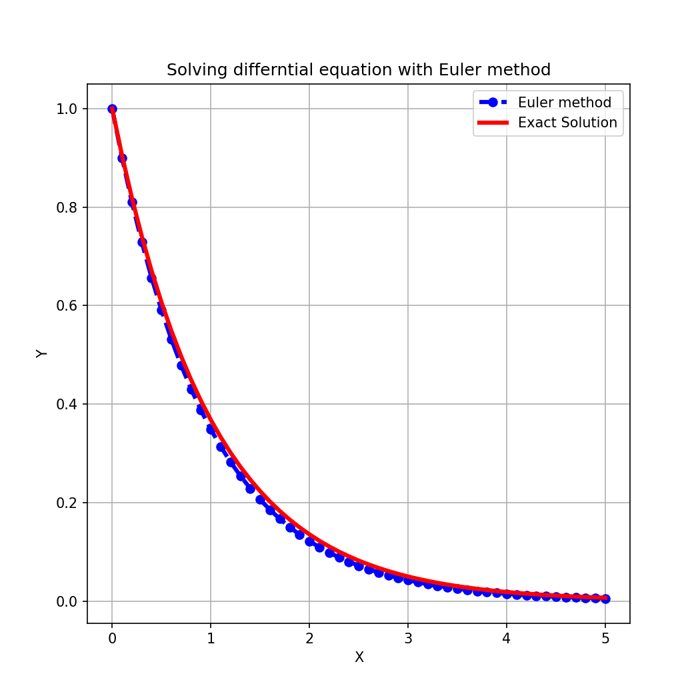
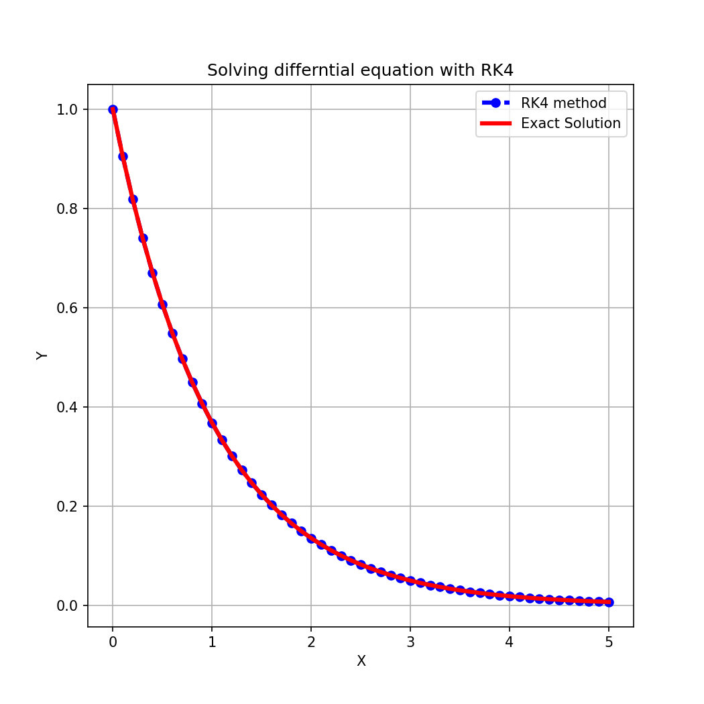
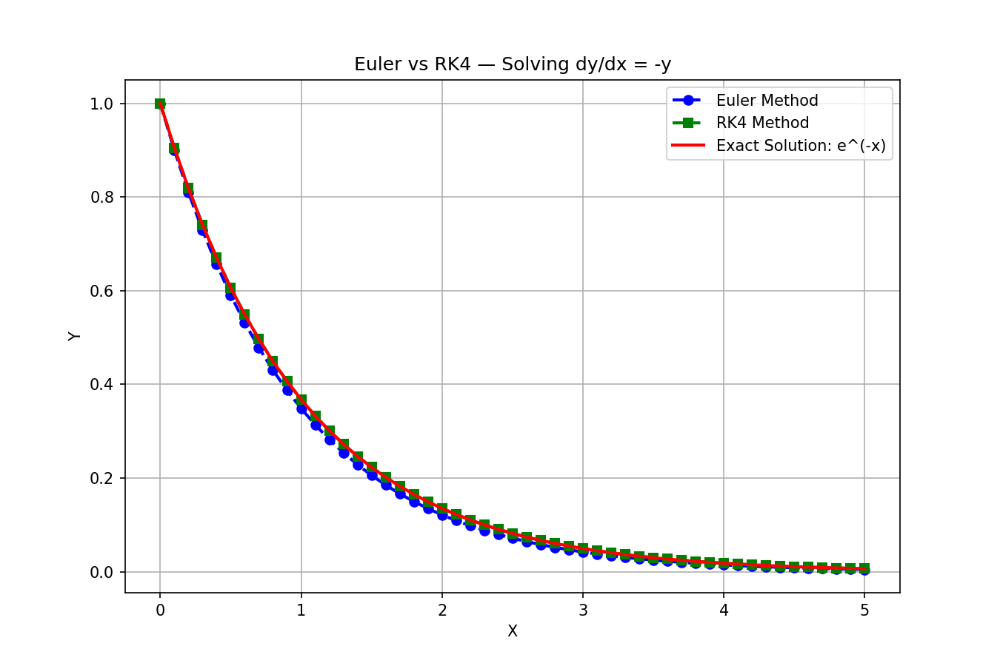
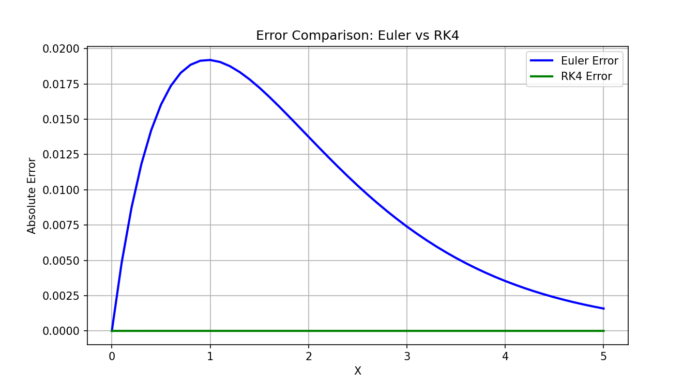

# Numerical ODE Solver 🧮

Solving the differential equation **dy/dx = -y** using three numerical methods: **Euler**, **RK2 (Midpoint)**, and **RK4 (Runge-Kutta 4th Order)** — with full visualization and error analysis in Python.

---

## 📌 Problem Statement

Solve the initial value problem:

$$\frac{dy}{dx} = -y, \quad y(0) = 1$$

**Exact (analytical) solution:** $y = e^{-x}$

We compare how closely each numerical method tracks this exact curve over the interval $x \in [0, 5]$.

---

## 📊 Results

### Euler Method

| Metric | Value |
|---|---|
| Max Absolute Error | **0.0192** |
| Final Numerical Value (x=5) | 0.0052 |
| Final Exact Value (x=5) | 0.0067 |

The Euler method uses only the slope at the current point to step forward, making it simple but prone to accumulated error — especially for larger step sizes.



---

### RK4 Method (Runge-Kutta 4th Order)

| Metric | Value |
|---|---|
| Max Absolute Error | **≈ 0.0000** |
| Final Numerical Value (x=5) | 0.0067 |
| Final Exact Value (x=5) | 0.0067 |

RK4 evaluates the slope at four points per step and takes a weighted average, resulting in dramatically higher accuracy — the numerical solution is virtually indistinguishable from the exact curve.



---

### Comparison: Euler vs RK4



The gap between the Euler (blue dots) and the exact solution (red line) is clearly visible, while RK4 (green squares) overlaps perfectly.

---

### Error Analysis



| Method | Max Error |
|---|---|
| Euler | ~0.0192 |
| RK4 | ~0.0000 (< 1e-6) |

The error plot makes the difference stark: RK4's error flatlines at zero on this scale, while Euler's error peaks around x ≈ 1 before decaying.

---

## 🧠 Methods Explained

### Euler Method
$$y_{n+1} = y_n + h \cdot f(x_n, y_n)$$

Uses the tangent line at the current point — first-order accuracy, $O(h)$ local error.

### RK4 (Runge-Kutta 4th Order)
$$y_{n+1} = y_n + \frac{h}{6}(k_1 + 2k_2 + 2k_3 + k_4)$$

Where:
- $k_1 = f(x_n,\ y_n)$
- $k_2 = f\!\left(x_n + \tfrac{h}{2},\ y_n + \tfrac{h}{2}k_1\right)$
- $k_3 = f\!\left(x_n + \tfrac{h}{2},\ y_n + \tfrac{h}{2}k_2\right)$
- $k_4 = f(x_n + h,\ y_n + h \cdot k_3)$

Fourth-order accuracy, $O(h^4)$ local error — far more precise for the same step size.

---

## ⚙️ Parameters

| Parameter | Value |
|---|---|
| Step size `h` | 0.1 |
| Interval | [0, 5] |
| Number of steps | 50 |
| Initial condition | y(0) = 1 |

---

## 🗂️ File Structure

```
numerical-ode-solver/
├── ode_solver.py          # Main script
├── Eulermethod.png        # Euler vs exact solution plot
├── RK4.png                # RK4 vs exact solution plot
├── comparison.png         # Side-by-side comparison
├── error_comparison.png   # Absolute error over x
└── README.md
```

---

## 🚀 How to Run

**Requirements:**
```bash
pip install numpy matplotlib
```

**Run:**
```bash
python ode_solver.py
```

This will generate all four plots and print the error summary to the console.

---

## 🔑 Key Takeaway

> With the same step size `h = 0.1`, RK4 achieves ~10,000× lower max error than Euler — demonstrating why higher-order methods are preferred in scientific computing.

---

## 👤 Author

**MOHAMED OSAMA**
